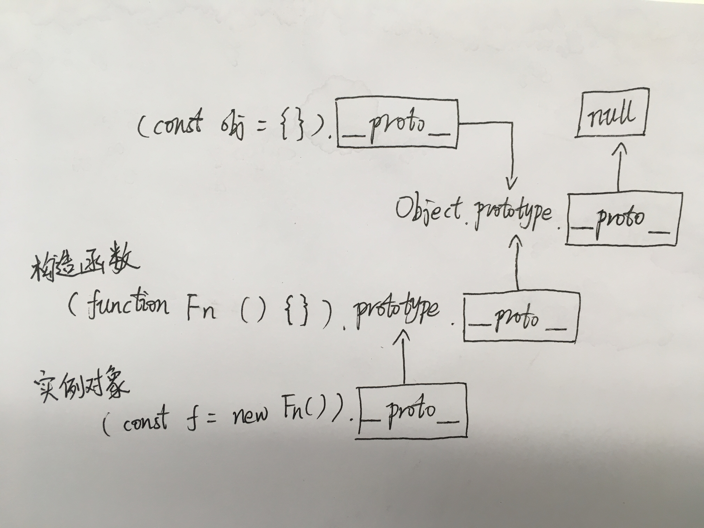

ES6 中的 class 容易让人遗忘 JavaScript 在没有 class 的时候，是用什么骚操作去实现类似其他语言的继承的，因此再梳理一遍。

# 三年前

从前从前，老夫写代码还是一把梭，jQuery ，function ，$(document).ready 就是干。

到后来出社会，发现前端的需求一个比一个骚，不能再 $(document).ready 就直接开干了。

由于 JavaScript 这东西是基于原型的，必须通过一些骚操作才能实现一个类似 class 的东西，并且能够继承复用。

那时候对原型和继承的知识的掌握是必不可少的，一入职就要求要学习并输出一篇笔记，本菜鸡之前只是稍微知道有 prototype 这东西，还不明白有这么些操作，赶紧打开 《JavaScript高级程序设计》 （没错，就是这本，虽然很菜但书还是要看高级的）翻到继承那章，稀里糊涂的就记上了一篇笔记，当时应该是似懂非懂，大概懂了的感觉（然而现在已经忘得差不多了）。

# 原型、构造函数与实例

由于 JavaScript 是基于原型的，因此我们需要先搞清楚原型是个什么玩意儿。

说起原型，就会想到 prototype ，经常看浏览器控制台的话，还会看到一个 `__proto__` 。那么这些东西，哪些是原型，其他属性又跟原型有什么关系呢？

首先，原型，就打个不恰当的比方吧，好比一个叫 Fn 的需求过来时给了你一个原型界面，诶，就把这个当成原型。

然后开发仔把这个原型界面用代码实现了一遍，诶，这个实现了的代码，就是构造函数。

代码上线，用户访问这个界面，相当于 new 了一下构造函数，最后每个用户屏幕上的界面，都是一个实例。

好了，脑袋中有这样一个场景，就可以把 JavaScript 原型相关的东西对应上：

1. 这个原型界面，就是 `Fn.prototype`
2. 开发仔把这个原型界面实现了，就有了构造函数 `Fn`
3. 用户访问界面，相当于 `var f = new Fn()` ，这个 `f` 就是实例

现在，需求方听说上线了，打开浏览器访问了这个界面，new 了一个实例出来，发现，哇，跟我给的原型一模一样，这时候，需求方脑袋中的这个印象，就是 `__proto__` ，从浏览器的界面联系到了原型界面。也就是：

```javascript
f.__proto__ === Fn.prototype // true
```

这时候，还有一个问题，就是需求方给的原型界面是怎么来的...天知道是怎么来的啊？！嗯？天知道？没错，就是一个叫 Object 的天，这个天，给了需求方一个灵感，作为 Fn 这个需求的原型，这个灵感就是 `Object.prototype` 。

上天看到了 `Fn.prototype` ，心想，可以啊，跟我给的灵感一模一样，于是，`Fn.prototype` 就跟 `Object.prototype` 联系上了，也就是：

```javascript
Fn.prototype.__proto__ === Object.prototype // true
```

这时候有人就要杠了，那 `Object.prototype` 又是怎么来的啊？

我们知道，许多神话传说创造世界都是从一片虚空开始的，盘古开天辟地，上帝创世等。诶，懂了没，这个 `Object.prototype` ，就是从虚空（ `null` ）来的，它跟虚空之间的联系就是：

```javascript
Object.prototype.__proto__ === null // true
```


扯了这么多，大概只搞懂了原型、构造函数跟实例之间的关系吧：

1. 构造函数有个原型对象，就是 `Fn.prototype` 。
2. 每个实例对象会有个 `__proto__` 属性指向这个实例的构造函数的原型对象。

# 原型链

上面看下来，你会发现 `__proto__` 这家伙不简单，把原型之间都串起来了：

```javascript
f.__proto__ === Fn.prototype
Fn.prototype.__proto__ === Object.prototype
Object.prototype.__proto__ === null
```

这一串，就是原型链。

大概是下面这张图的关系：



# 继承

正片开始。

我们假设有这样两个构造函数：

父亲：

```javascript
function Dad () {
  this.kind = 'human'
  this.gender = 'male'
  this.hobbies = [
    'coffee',
    'tea',
    'wife',
  ]
}

Dad.prototype.breakLeg = function () {
  console.log('打断她的腿')
}
```

女儿（别问为什么是女儿）：

```javascript
function Daughter () {
  this.gender = 'female'
  this.boyfriend = 'tan90'
  this.hobbies = [
    'piano',
    'chess',
    'writing',
    'painting',
  ]
}
```

然后要实现女儿继承父亲。

对了，为什么要把方法挂在原型对象上呢？这要从 [new](https://developer.mozilla.org/zh-CN/docs/Web/JavaScript/Reference/Operators/new) 这个关键字说起，一个构造函数 Fn 被 new 了，会创建一个继承自 `Fn.prototype` 的实例对象，因此，每个实例都可以从原型链中找到 `Fn.prototype` 上的方法，也就是这些方法是实例中共享的：

```javascript
dad_one.breakLeg === dad_two.breakLeg // true
// 等同于
dad_one.__proto__.breakLeg === dad_two.__proto__.breakLeg // true
```

而没有挂在原型对象上的则是每个实例独立的属性：

```javascript
dad_one.hobbies === dad_two.hobbies // false
```

因此我们把实例间需要共享的，一般是方法，挂在构造函数的原型对象上，而其他属性挂在 this 上。

## 原型链继承法

所谓原型链继承，就是很粗暴的，直接修改女儿的原型对象：

```javascript
Daughter.prototype = new Dad()

const daughter = new Daughter()
```

这样继承十分简单，把 Dad 的构造函数内的属性与原型对象上的方法全部挂在 Daughter 的原型对象上。

原型链就变成了：

```javascript
daughter.__proto__ === Daughter.prototype // true
Daughter.prototype.__proto__ === Dad.prototype // true
```

在使用时，看起来是挺正常的：

```javascript
daughter instanceof Daughter // true
daughter instanceof Dad // true
daughter.kind // 'human'
daughter.gender // 'female'
daughter.boyfriend // 'tan90'
```

但是有个问题，上面得出结论 `__proto__` 会把实例跟构造函数原型对象联系起来：

```javascript
daughter.__proto__.hobbies // ["coffee", "tea", "wife"]
```

这样一来，老爸有什么兴趣就全被女儿知道了，而且是所有子女之间共享的：

```javascript
const daughter_two = new Daughter()

daughter_two.__proto__.hobbies === daughter.__proto__.hobbies // true
```

这下老爸就慌了，每个人都有各自的兴趣，继承的时候覆盖掉就好了，没必要知根知底了，再说这样多费女儿脑容量（内存），是不？

## 借用构造函数法

这个方法需要在构造函数主体内容前面调用父类的构造函数：

```javascript
function Daughter () {
  // 调用父亲的构造函数
  Dad.call(this)
  this.gender = 'female'
  this.boyfriend = 'tan90'
  this.hobbies = [
    'piano',
    'chess',
    'writing',
    'painting',
  ]
}
```

是不是有点像 `super()` ？

这跟原型链法是两个极端，原型链继承法把父亲的所有属性都挂在女儿的原型对象上，而借用构造函数则是把父亲所有的属性都挂在构造函数里。

这样的话，女儿就没法继承父亲原型对象上的独门绝技 -> 打断腿 `breakLeg` 方法：

```javascript
const daughter = new Daughter()

daughter.breakLeg // undefined
```

那怎么办呢？我们可以把这个独门绝技放到父亲的构造函数中：

```javascript
function Dad () {
  this.kind = 'human'
  this.gender = 'male'
  this.hobbies = [
    'coffee',
    'tea',
    'wife',
  ]
  this.breakLeg = function () {
    console.log('打断她的腿')
  }
}
```

这样，女儿就可以成功传承独门绝技了。

不过这样做是有个问题的，相信你也看出来了，我们必须把方法都挂到构造函数的 `this` 上，而且你会发现，女儿学到的打断腿技能，跟父亲的不一样：

```javascript
const dad = new Dad()
const daughter = new Daughter()

dad.breakLeg === daughter.breakLeg // false
```

那怎么行呢，这继承得不正宗，而且有多少个子女继承父亲，就有多少种打断腿方法，而方法内容都是一样的，我们只需要一个就好，否则十分占用空间，上天看了都头大。

## 组合继承法

既然上面两种继承方法走的是两个极端，那我们就不能像小孩子一样做选择了，我全都要！

组合继承法，就是把上面两种方法都组合起来，同时父类的方法还是挂在父亲的原型对象上：

```javascript
function Dad () {
  this.kind = 'human'
  this.gender = 'male'
  this.hobbies = [
    'coffee',
    'tea',
    'wife',
  ]
}

Dad.prototype.breakLeg = function () {
  console.log('打断她的腿')
}

function Daughter () {
  // 调用父亲的构造函数
  Dad.call(this)
  this.gender = 'female'
  this.boyfriend = 'tan90'
  this.hobbies = [
    'piano',
    'chess',
    'writing',
    'painting',
  ]
}

// 继承父亲的打断腿技能
Daughter.prototype = new Dad()
```

诶，完美结合了原型链继承法与借用构造函数法的优点！

但是！这也完美结合了两者的缺点。

不知你是否发现，`Dad` 构造函数，总共被调用了两次，而且，跟原型链法的缺点一样，父亲的所有属性、方法，都被挂在了女儿的原型对象上，父亲的那点小爱好，又被女儿知道了。

## 原型式继承法与寄生式继承法

这俩的缺点跟原型链继承法与借用构造函数法的缺点类似，在这边就不啰嗦了。

## 寄生组合式继承

在组合继承中，你可能发现了，我们只要防止父亲构造函数中的内容，被挂在女儿原型对象上，这整个继承的实现就基本上是我们想要的了。

那么，要怎么做呢？看好，骚操作来了。

首先，我们引入一位父亲的分身。这个分身不知道父亲的爱好，但是他清楚父亲所有的技能，在这里就是那个打断腿的技能：

```javascript
function Temp () {}
Temp.prototype = Dad.prototype
const temp = new Temp()
```

现在，这个分身实例 `temp` 没有属性，只有一个打断腿技能。然后我们只需要让女儿用组合继承法，但是在继承方法时，改为继承这个分身，即可达到我们的目标。

```javascript
function Daughter () {
  // 调用父亲的构造函数
  Dad.call(this)
  this.gender = 'female'
  this.boyfriend = 'tan90'
  this.hobbies = [
    'piano',
    'chess',
    'writing',
    'painting',
  ]
}

// 继承父亲（分身）的打断腿技能
temp.constructor = Daughter
Daughter.prototype = temp

// 继承完成后可以在女儿原型对象上加新的技能
Daughter.prototype.sing = function () {
  console.log('I can sing.')
}

const daughter = new Daughter()
```

此时的原型链是：

```javascript
daughter.__proto__ === Daughter.prototype // true
daughter.__proto__ === temp // true
temp.__proto__ === Temp.prototype // true
temp.__proto__ === Dad.prototype // true
```

`temp` 的内容（也就是 `Daughter.prototype` 的内容）：

```javascript
temp: {
  constructor: Daughter,
  __proto__: {
    constructor: Dad,
    breakLeg: f (),
  },
}
```

可以发现我们执行的 `temp.constructor = Daughter` 给 `temp` 挂上了一个 constructor ，这样在查找构造函数时，会优先使用 `Daughter` ，而不是 `__proto__` 上挂的 `Dad` 。至于为什么要加上 constructor ，是为了不打破原型链，constructor 本是 prototype ，也就是原型对象上的一个属性。

实际上我们最终还是把方法都挂在了 `Daughter.prototype.__proto__` 上。

使用寄生组合式继承，我们还是调用了两次构造函数：

```javascript
const temp = new Temp()
Dad.call(this)
```

但是分身 `temp` 的构造函数内容是空的，对整个继承过程没有影响，同时不会把父亲 `this` 上的爱好等属性挂在女儿原型对象上。

### 继承方法抽离

看了一顿骚操作，有什么感受？是不是觉得好麻烦，每次继承都要搞一个 temp 出来。

没关系，我们可以稍微简化一下这个步骤，把创建 temp 的过程封装起来：

```javascript
function createTemp (Dad) {
  function Temp () {}
  Temp.prototype = Dad.prototype
  const temp = new Temp()
  return temp
}
```

这个 `createTemp` 方法，实际上就是刚刚没讲的原型式继承的方法。而 JavaScript 里，已经有个方法做了上述工作，就是 [Object.create](https://developer.mozilla.org/zh-CN/docs/Web/JavaScript/Reference/Global_Objects/Object/create) 。

然后，为了防止我们忘记怎么继承打断腿技能，可以把继承的过程也封装起来，整个继承原型方法的过程就是：

```javascript
function inheritPrototype (Daughter, Dad) {
  // 创建 temp
  const temp = createTemp(Dad)
  temp.constructor = Daughter
  Daughter.prototype = temp
}
```

把参数名替换一下，并用 `Object.create` 方法替换 `createTemp` 就是：

```javascript
function inheritPrototype (SubClass, SuperClass) {
  // 创建 temp
  const temp = Object.create(SuperClass)
  temp.constructor = SubClass
  SubClass.prototype = temp
}
```

至此，JavaScript 继承的回忆就结束了，不知道你对这种基于原型的继承思路有没有稍微清楚一点了呢？

# 参考

- 以前的文章
- [MDN 继承与原型链](https://developer.mozilla.org/zh-CN/docs/Web/JavaScript/Inheritance_and_the_prototype_chain)
